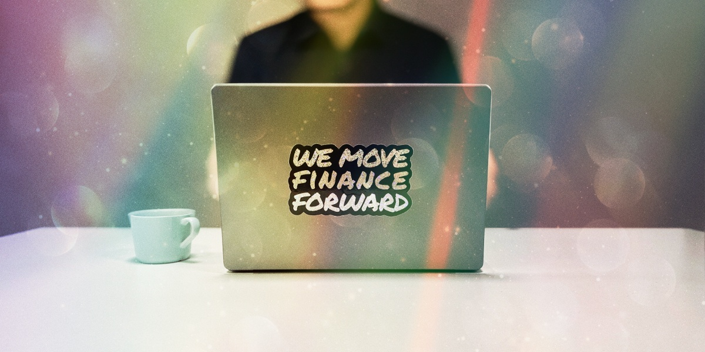

<h1 style="color: #AD362B">Hey, we are Stacc 👋</h1>

Stacc is a Norwegian fintech company with more than 30 years of experience delivering digital solutions and consulting services to banks, asset finance providers, insurance companies, pension funds, family offices and the public sector in the Nordics.

Stacc combines financial technology with design and strategic know-how.
We're fast, we understand, we help you do the right things the right way.
We enable financial services to innovate, surprise and excite.

<h2 style="color: #AD362B">
Do you feel like this suits you?
</h2>

We are always looking for talented people to join our team. If you are interested in working with us, please head on over to <a href="https://jobs.stacc.com/" style="color: #AD362B;">jobs.stacc.com</a>.

  
 
 
 
 
 
  

